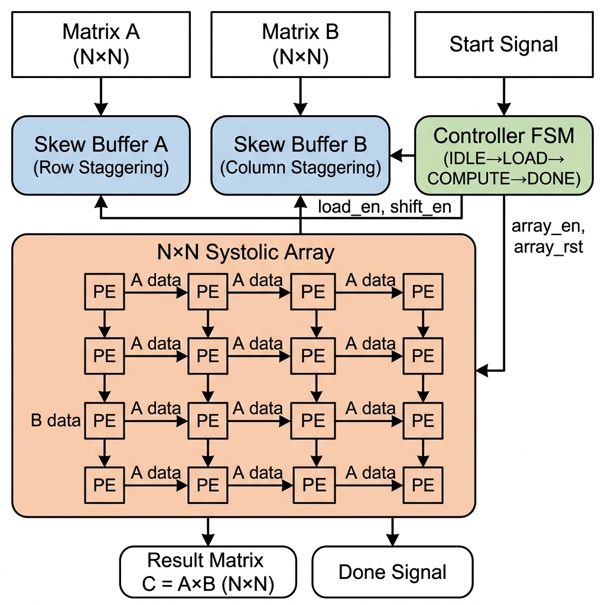
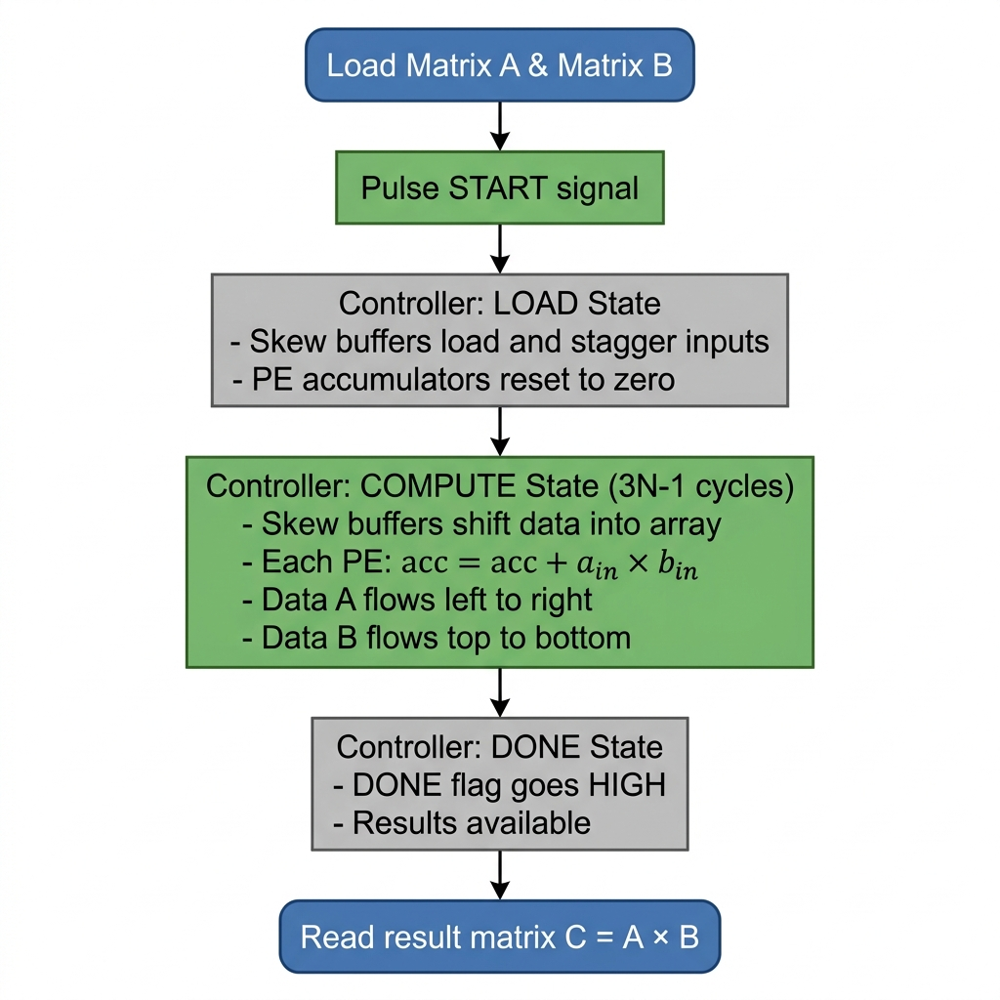

<p align="center">
  
</p>

<h1 align="center">⚡ 2D Systolic Array — Edge AI Accelerator</h1>

<p align="center">
  <strong>High-performance N×N matrix multiplication engine in Verilog for Edge AI inference</strong>
</p>

<p align="center">
  
  
  
  
  
</p>

<p align="center">
  <a href="#-architecture">Architecture</a> •
  <a href="#-quick-start-for-team-members">Quick Start</a> •
  <a href="#-branching-strategy">Branching</a> •
  <a href="#-project-structure">Structure</a> •
  <a href="#-how-to-simulate">Simulate</a> •
  <a href="#-team">Team</a>
</p>

---

## 🧠 What Is This?

A **2D Systolic Array** hardware accelerator designed for **matrix multiplication** — the core operation behind neural network inference on edge devices. Built from scratch in Verilog for the **Edge AI Hackathon 2026**.

> **Why Systolic Arrays?**  
> Google's TPU uses systolic arrays to achieve massive parallelism for AI workloads.  
> Our design brings this concept to **edge devices** — low power, high throughput, fully pipelined.

### Key Features

| Feature | Description |
|---------|-------------|
| 🔧 **Parameterized N×N** | Configure any matrix size (tested with 2×2 and 4×4) |
| ⚡ **Fully Pipelined** | Computes C = A × B in just `3N - 1` clock cycles |
| 🧱 **Modular Design** | PE → Array → Skew Buffers → Controller → Top |
| 📐 **8-bit Signed** | Configurable `DATA_WIDTH`, default 8-bit for INT8 inference |
| ✅ **Verified** | Testbenches for PE, 2×2 array, and full 4×4 system |

---

## 🏗️ Architecture

<p align="center">
  
</p>

The system consists of **4 core modules** orchestrated by an FSM controller:

```
                    ┌─────────────────────────────────────────────┐
                    │              systolic_top                    │
                    │                                             │
  Matrix A ──────► │  ┌────────────┐    ┌──────────────────┐     │
                    │  │ Skew Buf A │──►│                  │     │
                    │  └────────────┘   │   N×N Systolic   │     │──► Result C = A×B
                    │  ┌────────────┐   │      Array       │     │
  Matrix B ──────► │  │ Skew Buf B │──►│   (PE Grid)      │     │
                    │  └────────────┘   └──────────────────┘     │
                    │       ▲                    ▲                │
  Start ─────────► │  ┌────┴────────────────────┴───┐            │
                    │  │     Controller FSM          │──► Done   │
                    │  │  IDLE → LOAD → COMPUTE → DONE │         │
                    │  └────────────────────────────────┘         │
                    └─────────────────────────────────────────────┘
```

### Module Hierarchy

| # | Module | File | Purpose |
|---|--------|------|---------|
| 1 | `PE` | `1_pe.v` | Processing Element: `acc += a_in × b_in`, passes data to neighbors |
| 2 | `systolic_array` | `3_systolic_array.v` | Instantiates N×N grid of PEs with auto-wiring |
| 3 | `skew_buffer` | `5_skew_buffer.v` | Staggers matrix inputs for correct timing alignment |
| 4 | `controller` | `6_controller.v` | FSM that sequences LOAD → COMPUTE → DONE phases |
| 5 | `systolic_top` | `7_systolic_top.v` | Top-level wrapper connecting all modules |

---

## 🚀 Quick Start for Team Members

### Prerequisites

Make sure you have these installed:

| Tool | Install Command | Purpose |
|------|----------------|---------|
| **Git** | [Download Git](https://git-scm.com/downloads) | Version control |
| **Icarus Verilog** | `sudo apt install iverilog` / [Windows](http://bleyer.org/icarus/) | Verilog simulation |
| **GTKWave** *(optional)* | `sudo apt install gtkwave` / [Windows](http://gtkwave.sourceforge.net/) | Waveform viewer |

### Step 1 — Clone the Repository

```bash
# Clone via HTTPS (easiest)
git clone https://github.com/<your-username>/Edge-AI-Hackathon.git

# OR clone via SSH (if you have SSH keys set up)
git clone git@github.com:<your-username>/Edge-AI-Hackathon.git

# Enter the project
cd Edge-AI-Hackathon
```

> ⚠️ **Replace `<your-username>` with the actual GitHub username/org after pushing.**

### Step 2 — Create Your Working Branch

```bash
# Always pull the latest main first
git checkout main
git pull origin main

# Create your feature branch (pick a naming convention below)
git checkout -b feature/<your-name>/<what-you-are-working-on>

# Examples:
git checkout -b feature/rahul/add-8x8-testbench
git checkout -b feature/priya/optimize-pe-pipeline
git checkout -b fix/adarsh/skew-buffer-timing
```

### Step 3 — Make Changes & Commit

```bash
# Check what you changed
git status
git diff

# Stage your changes
git add .

# Commit with a meaningful message
git commit -m "feat: add 8x8 systolic array testbench"

# Push your branch to GitHub
git push origin feature/<your-name>/<what-you-are-working-on>
```

### Step 4 — Open a Pull Request

1. Go to the repo on GitHub
2. Click **"Compare & pull request"** (banner appears after push)
3. Write a description of your changes
4. Request review from a teammate
5. Merge after approval ✅

---

## 🌿 Branching Strategy

We follow a **feature-branch workflow** to keep things clean:

```
main (protected — always stable)
  │
  ├── develop (integration branch — merge features here first)
  │     │
  │     ├── feature/rahul/add-8x8-testbench
  │     ├── feature/priya/optimize-pe-pipeline
  │     ├── feature/adarsh/add-relu-activation
  │     └── fix/adarsh/skew-buffer-timing
  │
  └── release/v1.0 (tagged releases for submission)
```

### Branch Naming Convention

| Prefix | Use When | Example |
|--------|----------|---------|
| `feature/` | Adding new functionality | `feature/rahul/add-8x8-testbench` |
| `fix/` | Fixing a bug | `fix/priya/pe-overflow-fix` |
| `docs/` | Documentation only | `docs/adarsh/update-readme` |
| `experiment/` | Trying something new (may not merge) | `experiment/rahul/fp16-pe` |
| `refactor/` | Restructuring code without changing behavior | `refactor/priya/clean-controller` |

### Rules

> [!IMPORTANT]
> - **Never push directly to `main`** — always use a Pull Request
> - **Always pull before you push** — `git pull origin develop` before starting work
> - **One feature per branch** — keep branches small and focused
> - **Write descriptive commit messages** — your teammates will thank you

### Useful Git Commands

```bash
# See all branches (local + remote)
git branch -a

# Switch to an existing branch
git checkout develop

# Update your branch with latest develop
git checkout feature/your-branch
git merge develop

# Delete a branch after merging
git branch -d feature/your-old-branch

# See commit history (pretty)
git log --oneline --graph --all

# Stash your work temporarily
git stash
git stash pop    # get it back
```

---

## 📁 Project Structure

```
Edge-AI-Hackathon/
│
├── 📄 README.md                          ← You are here
├── 📄 .gitignore                         ← Git ignore rules
│
├── 📂 2D-systolic-array/                 ← Core RTL Design
│   ├── 1_pe.v                            ← Processing Element
│   ├── 2_pe_tb.v                         ← PE Testbench
│   ├── 3_systolic_array.v                ← N×N Systolic Array
│   ├── 4_systolic_2x2_tb.v              ← 2×2 Array Testbench
│   ├── 5_skew_buffer.v                   ← Input Skew Buffer
│   ├── 6_controller.v                    ← FSM Controller
│   ├── 7_systolic_top.v                  ← Top-Level Wrapper
│   ├── 8_systolic_4x4_tb.v              ← Full 4×4 System Testbench
│   ├── block_diagram.png                 ← System Architecture Diagram
│   └── flowchart.png                     ← FSM Flowchart
│
├── 📂 assets/                            ← Hackathon Documents
│   ├── EDGE-AI_2026_PROBLEM_STATEMET.docx
│   ├── EDGE-AI_ABSTRACT.docx
│   └── Edge_AI_Hackathon_Brochure.pdf
│
└── 📄 2D_Systolic_Array_Innovation_Ideas_Report.pdf
```

---

## 🔬 How to Simulate

### Run the PE Testbench

```bash
cd 2D-systolic-array

# Compile
iverilog -o pe_tb.vvp 1_pe.v 2_pe_tb.v

# Simulate
vvp pe_tb.vvp

# View waveforms (optional)
gtkwave pe_tb.vcd
```

### Run the 2×2 Array Testbench

```bash
iverilog -o systolic_2x2.vvp 1_pe.v 3_systolic_array.v 4_systolic_2x2_tb.v
vvp systolic_2x2.vvp
gtkwave systolic_2x2_tb.vcd
```

### Run the Full 4×4 System Testbench

```bash
iverilog -o systolic_4x4.vvp 1_pe.v 3_systolic_array.v 5_skew_buffer.v 6_controller.v 7_systolic_top.v 8_systolic_4x4_tb.v
vvp systolic_4x4.vvp
gtkwave systolic_4x4_tb.vcd
```

---

## ⚙️ Configuration

Both `DATA_WIDTH` and `N` are parameterized. To change matrix size or precision:

```verilog
// In systolic_top.v or your testbench:
systolic_top #(
    .N(8),              // 8×8 matrix multiplication
    .DATA_WIDTH(16)     // 16-bit signed inputs
) dut ( ... );
```

| Parameter | Default | Description |
|-----------|---------|-------------|
| `N` | 4 | Matrix dimension (N×N) |
| `DATA_WIDTH` | 8 | Bit width of each element (signed) |
| Accumulator | `2 × DATA_WIDTH` | Auto-sized to prevent overflow |

---

## 🧪 Verified Test Cases

| Test | Matrix Size | Status |
|------|-------------|--------|
| PE unit test | 1×1 | ✅ Passed |
| Identity multiplication | 2×2 | ✅ Passed |
| Known-answer test | 4×4 | ✅ Passed |
| Negative numbers | 4×4 | ✅ Passed |

---

## 🤝 Team

| Member | Role | Branch |
|--------|------|--------|
| **Adarsh** | Lead / Architecture | `main` |
| *Member 2* | *Role* | `feature/name/...` |
| *Member 3* | *Role* | `feature/name/...` |
| *Member 4* | *Role* | `feature/name/...` |

> 📝 **Team members**: Update this table with your name and role after cloning!

---

## 📜 License

This project is built for the **Edge AI Hackathon 2026**. See the hackathon rules for usage terms.

---

<p align="center">
  <strong>Built with 💡 for Edge AI Hackathon 2026</strong><br/>
  <sub>Accelerating AI at the Edge — One Systolic Array at a Time</sub>
</p>
