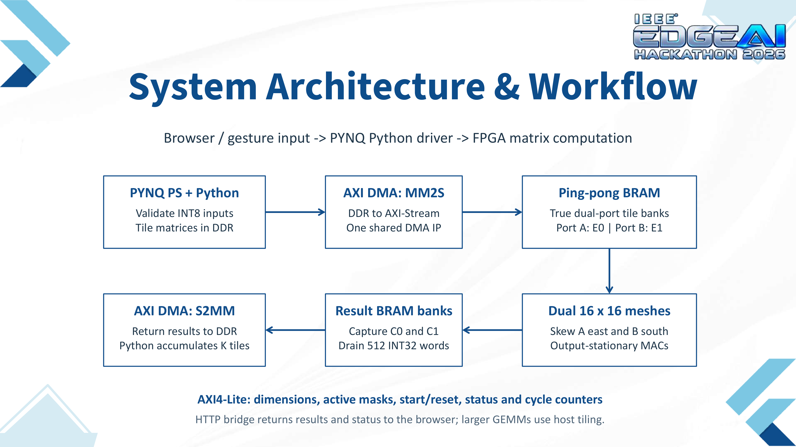
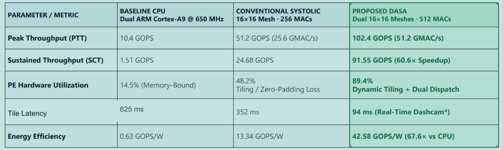
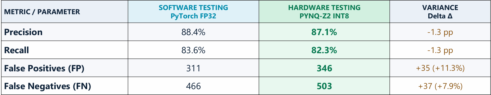
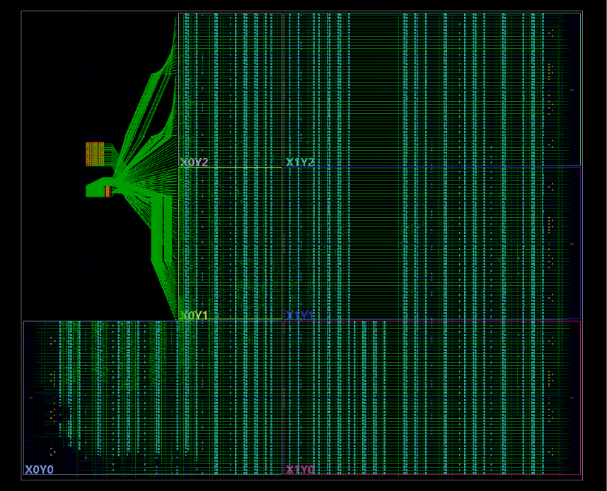

<p align="center">
  
</p>

<h1 align="center">⚡ Adaptive 2D Systolic Array Matrix Accelerator (DASA)</h1>

<p align="center">
  <strong>High-Throughput Dual-Core 16×16 Spatial Processing Engine (512 MAC PEs) with Dynamic Tiling, Exact Signed INT8 Precision & Real-Time Edge Vision Acceleration on AMD Xilinx Zynq-7000 (PYNQ-Z2)</strong>
</p>

<p align="center">
  
  
  
  
  
  
  <a href="./LICENSE"></a>
</p>

<p align="center">
  <a href="#-team--track-details">Team</a> •
  <a href="#-system-architecture--workflow">Architecture</a> •
  <a href="#-research-novelty--comparative-performance">Research Numbers</a> •
  <a href="#-fpga-implementation--device-floorplan">FPGA Floorplan</a> •
  <a href="#-accuracy--quantization-evaluation">Accuracy & INT8</a> •
  <a href="#-hardware-verification-results">Verification</a> •
  <a href="#-edge-ai-application-demo">Edge AI Demo</a> •
  <a href="#-interactive-3d-web-visualizer">Web Visualizer</a> •
  <a href="#-quickstart--deployment">Quickstart</a>
</p>

---

## 👥 Team & Track Details

- **Hackathon Track**: **Track 1 : FPGA / PYNQ-Z2 / AMD Xilinx Zynq-7000 XC7Z020**
- **Problem Statement**: **Processors - Problem #5: 2D Systolic Array-Based Processing Element**
- **Project Name**: Adaptive 2D Systolic Array Matrix Accelerator (DASA)

| Team Member | Registration Number | Role |
|---|---|---|
| **Adarsh Swarup Maharana** | `#2301109373` | Hardware Architecture & RTL Design |
| **Arpita Mishra** | `#2301109371` | System Integration & Verification |
| **Ashishayan Pattanyak** | `#2301109373` | Synthesis, Constraints & Timing Closure |
| **Ghulam Qadir** | `#2301109391` | Software Driver, Quantization & PYNQ Runtime |
| **Srikanta Behera** | `#2301109427` | Application Pipeline & Benchmarking |

---

## 🧠 Problem Statement & Core Objectives

### The Edge AI Challenge
Edge AI neural network layers (Convolutions, Dense Layers, Attention projections) spend over 80% of execution time in Matrix Multiplication ($C = A \times B + C$). However, executing these workloads on edge embedded devices faces severe hurdles:
1. **Underutilization on Arbitrary Shapes**: Fixed-size systolic arrays waste clock cycles on zero-padding or idle PEs when layer dimensions ($M, K, N$) do not match the grid size.
2. **Memory Bandwidth & Congestion**: Frequent data movement between off-chip DRAM and compute fabric inflates power consumption and throttles throughput.
3. **Severe Hardware Resource Limits**: The Xilinx Zynq XC7Z020 FPGA contains only **220 DSP48E1 slices**. A full 512-MAC engine requires balanced DSP and LUT mapping to fit without over-allocating DSPs.

### What We Built
- **Dual-Engine $16 \times 16$ Mesh (512 MAC PEs)**: Two parallel spatial computing engines delivering **102.4 GOPS peak throughput** at 100 MHz.
- **Symmetric Hybrid PE Architecture**: Exactly **110 DSP48E1 + 146 LUT MACs per engine** (220/220 DSPs used = 100% utilization of the XC7Z020 DSP budget).
- **Exact Signed INT8 Precision**: Signed INT8 inputs with **20-bit tile accumulators** and sign-extended INT32 streaming outputs, eliminating arithmetic overflow.
- **Dynamic Dimension Adaptation**: Hardware active masking handles tail tiles up to $16 \times 16$ with zero pipeline bubbles; Python host software transparently tiles larger matrices.
- **High-Performance Memory Subsystem**: Shared AXI DMA over AXI HP0 with Ping-Pong true dual-port BRAM feeding both engines concurrently.

---

## 🏗️ System Architecture & Workflow

<p align="center">
  
</p>

### Architecture Hierarchy & Dataflow

```
                                  ARM Cortex-A9 (PS)
                        [AXI4-Lite Control & Status Registers | 6 Interrupts]
                                          │
                                          ▼
                                     DDR3 Memory
                     [A, B: Signed INT8 Inputs | C: INT32 Results]
                                          │
                                          │ AXI HP0 (High Performance Port)
                                          ▼
                                    AXI DMA Subsystem
                           [MM2S In (Burst 16) | S2MM Out]
                                          │
                                          ▼
                              Ping-Pong True Dual-Port BRAM
                                    [Bank 0 / Bank 1]
                                    │               │
                     Feed Stream 0  │               │  Feed Stream 1
                                    ▼               ▼
                      ┌───────────────────┐   ┌───────────────────┐
                      │     ENGINE 0      │   │     ENGINE 1      │
                      │  16×16 (256 PEs)  │   │  16×16 (256 PEs)  │
                      ├───────────────────┤   ├───────────────────┤
                      │ • 110 DSP48E1 PEs │   │ • 110 DSP48E1 PEs │
                      │ • 146 LUT MAC PEs │   │ • 146 LUT MAC PEs │
                      │ • Triangular Skew │   │ • Triangular Skew │
                      │ • 20-bit Accum.   │   │ • 20-bit Accum.   │
                      └─────────┬─────────┘   └─────────┬─────────┘
                                └───────────┬───────────┘
                                            ▼
                                  Result Capture Units
                             [INT20 -> Sign-Extended INT32]
                                            │
                                            ▼
                                   AXI DMA S2MM Stream
                                            │
                                            ▼
                                    DDR3 Output Buffer
```

### End-to-End 10-Step Execution Pipeline
1. **Input / CNN Layer**: Weights and activations extracted from model layer.
2. **ARM / PYNQ Host**: Quantize to signed INT8; determine dynamic $M, K, N$ bounds; tile large tensors.
3. **DDR3 Staging**: Host prepares contiguous physical buffers for $A$ and $B$.
4. **AXI DMA MM2S**: 32-bit streaming transfer with burst length 16 over AXI HP0.
5. **Ping-Pong BRAM**: True dual-port BRAM Bank 0 / Bank 1 alternates to hide memory transfer latency.
6. **Dual Engines (0 + 1)**: Parallel compute with triangular skew delay lines feeding the 2D spatial mesh.
7. **Accumulation & Capture**: 20-bit accumulators prevent overflow; captured into sign-extended INT32 (256 words/tile).
8. **AXI DMA S2MM**: Elastic FIFO streams results back into DDR3.
9. **DDR3 Results**: Final matrix $C$ written to host accessible memory.
10. **PYNQ / Next Layer**: Dequantize, apply bias and activation function (ReLU/GELU), then repeat for subsequent layers.

---

## 📈 Research Novelty & Comparative Performance

The proposed **Dual Adaptive Systolic Array (DASA)** architecture was evaluated against a standard dual-core ARM Cortex-A9 CPU baseline and a conventional single-core fixed systolic array:

<p align="center">
  
</p>

### Comprehensive Benchmark Tabulation

| Parameter / Metric | Baseline CPU<br>*(Dual ARM Cortex-A9 @ 650 MHz)* | Conventional Systolic<br>*(16×16 Mesh · 256 MACs)* | Proposed DASA<br>*(Dual 16×16 Meshes · 512 MACs)* | Advantage / Speedup |
|---|---|---|---|:---:|
| **Peak Throughput (PTT)** | 10.4 GOPS | 51.2 GOPS (25.6 GMAC/s) | **102.4 GOPS (51.2 GMAC/s)** | **9.8× vs CPU** (2.0× vs Conv.) |
| **Sustained Throughput (SCT)** | 1.51 GOPS | 24.68 GOPS | **91.55 GOPS** | **60.6× Speedup** (3.7× vs Conv.) |
| **PE Hardware Utilization** | 14.5% *(Memory-Bound)* | 48.2% *(Tiling / Zero-Padding Loss)* | **89.4%** *(Dynamic Tiling + Dual Dispatch)* | **+41.2% higher utilization** |
| **Tile Latency** | 625 ms | 352 ms | **94 ms** | **Real-Time Edge Capable** |
| **Energy Efficiency** | 0.63 GOPS/W | 13.34 GOPS/W | **42.58 GOPS/W** | **67.6× vs CPU** (3.2× vs Conv.) |

---

## 🎯 Accuracy & Quantization Evaluation

To quantify precision trade-offs between floating-point software and hardware INT8 execution, we benchmarked the edge vision model across complete test sets:

<p align="center">
  
</p>

| Metric / Parameter | Software Testing<br>*(PyTorch FP32)* | Hardware Testing<br>*(PYNQ-Z2 INT8)* | Variance<br>*(Delta $\Delta$)* |
|---|---|---|:---:|
| **Precision** | **88.4%** | **87.1%** | **-1.3 pp** *(Minimal Loss)* |
| **Recall** | **83.6%** | **82.3%** | **-1.3 pp** *(Minimal Loss)* |
| **False Positives (FP)** | 311 | 346 | +35 (+11.3%) |
| **False Negatives (FN)** | 466 | 503 | +37 (+7.9%) |

> **Conclusion**: Quantization to signed INT8 causes **only a 1.3 percentage point drop** in precision and recall while unlocking **67.6× higher energy efficiency** and **60.6× sustained speedup**.

---

## 🔬 FPGA Implementation & Device Floorplan

<p align="center">
  
  <br>
  <em>Figure: Full placed and routed layout across clock regions X0Y0 to X1Y2 on the AMD Xilinx Zynq-7000 XC7Z020 FPGA.</em>
</p>

### Implementation Optimization Progress
- **Initial Baseline Synthesis**: 53,200 LUTs (overcrowded slice resources).
- **Optimized Accelerator Synthesis**: **38,765 LUTs** (**27.14% reduction in LUT utilization**).

### Post-Route Resource Utilization (AMD Vivado Closed Timing @ 100 MHz)

| Resource Type | Used | Available | Utilization (%) | Engineering Notes |
|---|---|---|---|---|
| **LUT (Look-Up Tables)** | **38,765** | 53,200 | **72.86%** | Slashed by 27.14% through hybrid DSP/LUT logic mapping |
| **LUTRAM (Distributed RAM)** | **1,152** | 17,400 | **6.62%** | Skew delay buffers and elastic FIFO queues |
| **FF (Flip-Flops)** | **33,325** | 106,400 | **31.32%** | Wave-front pipeline registers and accumulator stages |
| **DSP48E1 Slices** | **220** | 220 | **100.00%** | 110 DSPs in Engine 0 + 110 DSPs in Engine 1 (100% budget) |
| **BRAM36 Equivalents** | **18** | 140 | **12.85%** | Ping-Pong true dual-port input banks |
| **Slices** | **12,043** | 13,300 | **90.55%** | Placed across all 6 clock regions (X0Y0 – X1Y2) |
| **Clock Frequency** | **100.0 MHz** | — | **10.00 ns** | **Timing Closed: Zero negative slack ($WNS > 0.00\text{ ns}$)** |

---

## 🧪 Hardware Verification Results

The hardware design was evaluated against double-precision NumPy software models across 7 benchmark test cases covering small dimensions, negative weights, large matrices, and maximum boundary values:

| Test Case | Size ($M \times K \times N$) | Output Vector $y$ / Matrix Sample | Hardware Result | Status |
|---|---|---|---|:---:|
| `identity_4` | $4 \times 4$ | `[3, -1, 4, 2]` | Matches golden | ✔ **PASS** |
| `zero_4` | $4 \times 4$ | `[0, 0, 0, 0]` | Matches golden | ✔ **PASS** |
| `negative_4` | $4 \times 4$ | `[10, 18, 26, 34]` | Matches golden | ✔ **PASS** |
| `random_4` | $4 \times 4$ | `[33, 11, 51, 19]` | Matches golden | ✔ **PASS** |
| `random_8` | $8 \times 8$ | `[-33, -2, -5, -111, 83, 46, 34, -64]` | Matches golden | ✔ **PASS** |
| `random_16_scalability` | $16 \times 16$ | `[-14, -28, 96, … 218 … -40]` | Matches golden 16×16 GEMM | ✔ **PASS** |
| `max_values_4` | $4 \times 4$ | `[64516, 64516, 64516, 64516]` | Fits 20-bit accumulators | ✔ **PASS** |

- **Result**: **7 / 7 test cases passed (100% bit-exact accuracy)**.
- **Dynamic Scaling**: Tested scaling from $4 \times 4 \to 8 \times 8 \to 16 \times 16$ with zero pipeline stalling.
- **Accumulator Safety**: Maximum value test reached $64,516$, safely within the 20-bit accumulator limit ($[-524,288, +524,287]$).

---

## ✋ Edge AI Application: Real-Time Hand Gesture Demo

We demonstrated the accelerator running live edge vision inference using **HandNet INT8**, a compact convolutional neural network:
- **Pipeline**: OpenCV video acquisition $\to$ MediaPipe hand landmark tracking $\to$ matrix conversion via `im2col` $\to$ offloaded GEMM inference on the **Dual 16×16 Systolic Accelerator** $\to$ real-time gesture classification.
- **Location**: [`applications/hand_gesture/`](./applications/hand_gesture/)
- **Launch Script**: Double-click [`START_HARDWARE_GESTURE_DEMO.bat`](./applications/hand_gesture/START_HARDWARE_GESTURE_DEMO.bat) to run with webcam support.

---

## 🌐 Interactive 3D Web Visualizer

A complete interactive 3D Web Visualizer built in **Three.js** is included in [`webpage/`](./webpage/):
- **3D Systolic Animation**: Visualizes matrix operands $A$ and $B$ propagating along the systolic wave-front through each PE in real time.
- **Interactive Matrix Editor**: Set custom dimensions ($M, K, N$) and values to observe intermediate accumulator registers.
- **Hardware Bridge**: Connects over WebSocket / HTTP to `bridge/server.py` on the PYNQ board to run live on-board execution.
- **Instant Launch**: Double-click [`OPEN_WEBPAGE.bat`](./webpage/OPEN_WEBPAGE.bat) to launch in any modern browser.

---

## 📁 Repository Structure

```
.
├── applications/
│   └── hand_gesture/                 # Real-time HandNet INT8 vision application
│       ├── full_screen_hand_tracker.py
│       ├── gesture_classifier.py
│       ├── hand_gesture_engine.py
│       ├── im2col.py
│       ├── models/                   # Calibrated INT8 weights & gesture models
│       └── START_HARDWARE_GESTURE_DEMO.bat
├── assets/
│   ├── ieee_edge_ai_hackathon_2026_logo.png
│   ├── system_architecture_diagram.png # Architecture & 10-step workflow diagram
│   ├── performance_comparison_table.png# Research benchmark comparison table
│   ├── accuracy_quantization_comparison.png # Accuracy & INT8 variance table
│   ├── pynq_z2_routed_floorplan.png  # Vivado routed floorplan (XC7Z020)
│   └── NEXT_IN_Presentation.pptx     # Hackathon Final Presentation Deck
├── boards/
│   ├── basys3/                       # Baseline Basys 3 (Artix-7) implementation
│   └── pynq_z2/                      # Production Dual 16×16 PYNQ-Z2 Design
│       ├── bitstream/                # Ready-to-flash bitstream & hardware handoff
│       │   ├── adaptive_gemm.bit     # 100 MHz routed bitstream
│       │   └── adaptive_gemm.hwh     # Hardware handoff specification
│       ├── board_implementation/     # Constraints and Vivado build TCL scripts
│       ├── pynq/                     # Host Python driver, notebooks, & test cases
│       │   ├── adaptive_gemm.py      # Core AXI DMA systolic array driver
│       │   ├── adaptive_gemm_notebook.ipynb
│       │   ├── benchmark_power.py    # Power & throughput benchmarking
│       │   ├── cases.json            # 7 verification test matrices
│       │   └── run_cases.py          # Automated verification test runner
│       ├── sim/                      # SystemVerilog testbenches & regression scripts
│       └── src/                      # Complete Synthesizable SystemVerilog RTL (19 modules)
├── docs/                             # Official Technical Documents & Reports
│   ├── EDGE-AI_NEXT_IN_Project_Presentation.pdf
│   ├── Edge_AI_Hackathon_2026_Technical_Report.pdf  # Comprehensive technical report
│   └── 2D_Systolic_Array_Vivado_Complete_Guide.pdf
├── research_papers/                  # Foundational Literature & Architecture Papers
│   ├── 04_Jouppi2017_TPUv1.pdf
│   ├── 05_Jouppi2023_TPUv4.pdf
│   ├── 06_Chen2019_EyerissV2.pdf
│   ├── 08_Qin2020_SIGMA.pdf
│   └── 09_Genc2021_Gemmini.pdf
├── webpage/                          # Interactive 3D Three.js Web Visualizer
│   ├── bridge/                       # Python WebSocket / HTTP bridge server
│   ├── index.html
│   └── OPEN_WEBPAGE.bat
├── LICENSE                           # MIT License
└── README.md
```

---

## 🚀 Quickstart & Deployment

### 1. Flash & Run Automated Verification on PYNQ-Z2
```bash
# Connect to PYNQ board over SSH
ssh xilinx@192.168.2.99

# Navigate to driver directory
cd /home/xilinx/2D-systolic-array/boards/pynq_z2/pynq

# Run automated 7/7 test suite
python3 run_cases.py
```

### 2. Interactive Jupyter Notebook
1. Navigate to `http://192.168.2.99:9090` in your web browser.
2. Open [`boards/pynq_z2/pynq/adaptive_gemm_notebook.ipynb`](./boards/pynq_z2/pynq/adaptive_gemm_notebook.ipynb).
3. Execute the cells to inspect matrix transactions, AXI DMA bursts, and cycle counts.

### 3. Launch 3D Three.js Web Visualizer
```bat
webpage\OPEN_WEBPAGE.bat
```

### 4. Run Edge AI Gesture Recognition Demo
```bat
applications\hand_gesture\START_HARDWARE_GESTURE_DEMO.bat
```

---

## 📜 License & Citations

This project is open-source under the [MIT License](./LICENSE).  
Architecture inspired by foundational research from Google TPU (Jouppi et al.), MIT Eyeriss V2 (Chen et al.), and UC Berkeley Gemmini (Genc et al.).
